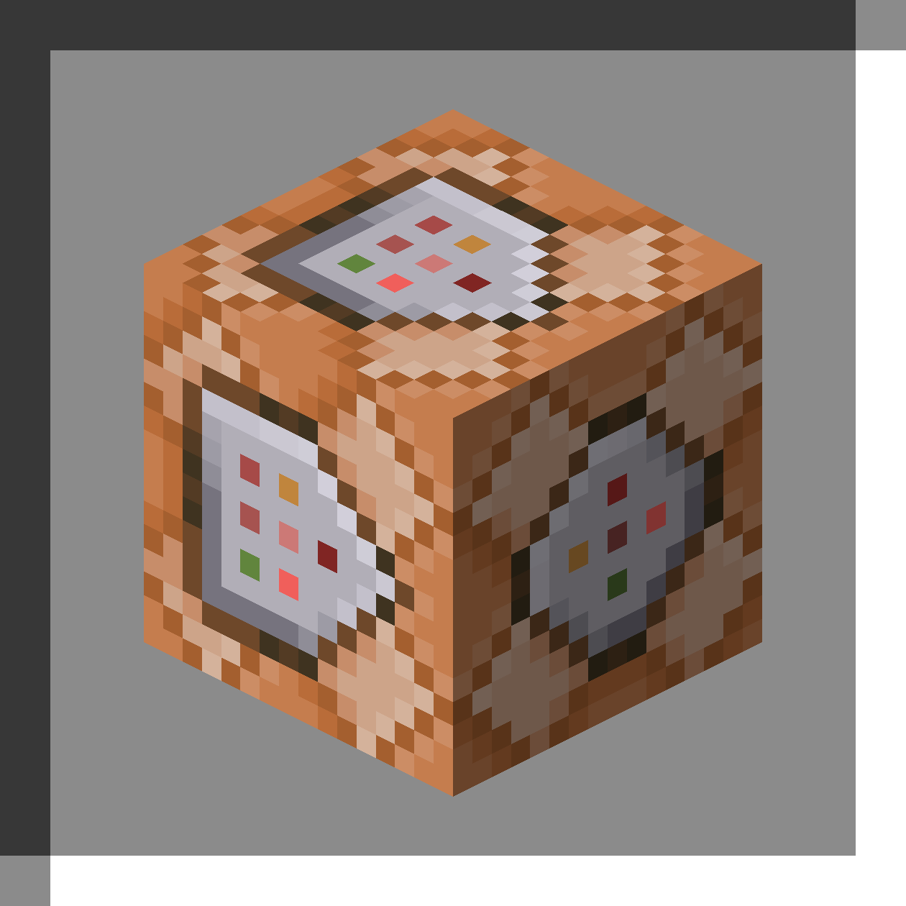
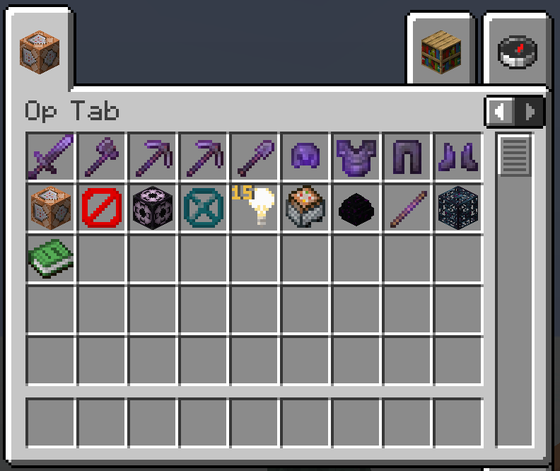

<div align="center">
  
</div>
<h1 align="center">Op Tab (Fabric)</h1>

This mod is inspired by [Op Tab](https://modrinth.com/mod/optab)

# Example


# Build with source
1. Set up enviroment
- Install JDK 21

2. Clone repository
```
git clone https://github.com/tmquan2508/optabfabric.git
cd optabfabric
```

3. Build the mod
```
./gradlew build
```
